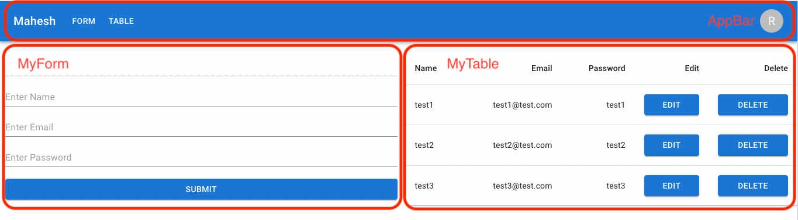

# プロジェクトの紹介

## introduction

Reactアプリケーションで状態管理のためReduxを使うのがデファクトスタンダードになっています。

* Reactの状態管理ライブラリはRedux以外にもRecoil、Zustandなど多くありますが、現場ではほぼReduxを使っているらしくて、その使い方に慣れる必要があります。
* Reactで仕事をすることはReduxで状態管理することだと考えてもいいでしょう。

それで、React + Redux-Toolkit + Redux-Saga + TypeScriptでサンプル用のCRUDアプリを作って見ました。

参考にしたのは[ここ](https://github.com/itsmaheshkariya/react-redux-saga-crud-app)ですが、muiを使っているComponentを除いて肝心のところであるsliceやsagaなどは作り直しました。

* 実行画面

AppBar、MyForm、MyTableという三つのComponentで構成されています。

### Redux-Toolkitとは

* Reduxを用いた開発を効率的に行うためのツールキット（ライブラリの集まり）
* 従来のReduxと比べて、コード量が少ない。
  * 従来のReduxではaction、TypeScriptのtypeなどboilerplateコードをたくさん作らないといけない。
  * それを少しでも減らせるためにtypescript-fsaやtypescript-fsa-reducersなどを使っていた。
    * https://qiita.com/m0a/items/703d64c74e43cb392a64
  * Redux-Toolkitでは作成されたsliceを元にactionやそのtypeを自動で生成してくれる。
    * sliceはactionとreducerを管理するためのもの
* TypeScriptとの相性がいい。

**Redux ApplicationのData Flow**

[公式サイト](https://redux.js.org/tutorials/essentials/part-1-overview-concepts)から持って来ましたが、個人的には今まで見たData Flow図の中で一番わかりやすいと思います。

* 状態管理とは、グローバル変数の管理です。
* この記事を読んでいる方はReactのComponentでuseStateを使った経験はあるかと思いますが、それはローカル変数に相当するものです。
* 上記の図でUIはComponentです。ComponentでClickイベントが発火して**10$を引き出すaction**を**Dispatch**関数を用いてStoreに送ります。
* Reducerはactionごとに処理が分岐されるswitch文を持っている関数です。
* 最初は10$の預金がありましたが、その10$を引き出したので、預金が0$になりました。

### Redux-Sagaとは

* Reduxアプリケーションにおける副作用（データ通信などの非同期処理、ブラウザキャッシュへのアクセスなどpureではない処理）を管理するためのライブラリ
  * Reduxは副作用がないpureで作らなければならない。それで副作用が発生する処理についてはThunkやSagaなどのmiddlewareを使って処理する。

JSで副作用（英語：Side Effect）はエラーを起こすことが多く、デバッグが難しくなるため、なるべく純粋関数（pure function）で作るのが原則です。
しかし、一般的なアプリケーションでデータ通信など副作用が発生するケースは欠かせないものです。
それをReduxで管理するためStoreの外側にmiddlewareを用意して副作用はそのmiddlewareで管理することになりました。
ReduxではThunkを用いて副作用を管理しますが、テストしやすいコードが書けるとのことでSagaが流行りになりました。

※ 現在はRedux ToolkitでThunkとRTK Queryを使うまたは、SWRやReact Queryで使うことも多いかと思います。

**Redux Applicationで非同期処理を行う時のData Flow**

これも[公式サイト](https://redux.js.org/tutorials/essentials/part-5-async-logic)から持って来ました。

* APIとのやりとりをするmiddlewareが追加されました。
* Dispatchで「Action/Thunk」をmiddlewareに送っていますが、Redux-Sagaの場合は「Action/Saga」になるだけで仕組みは同じです。
